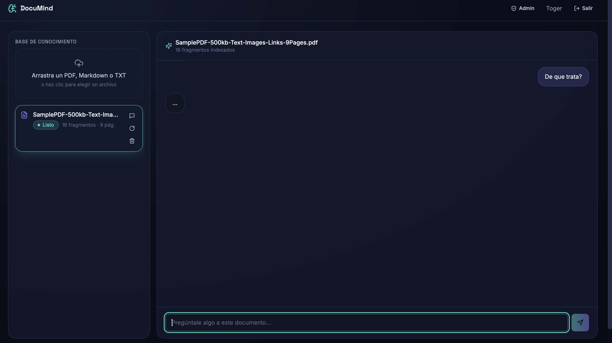
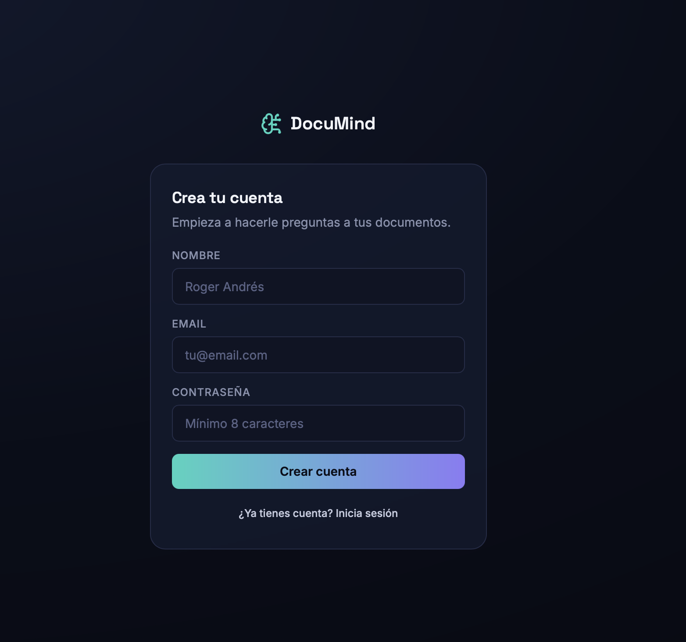
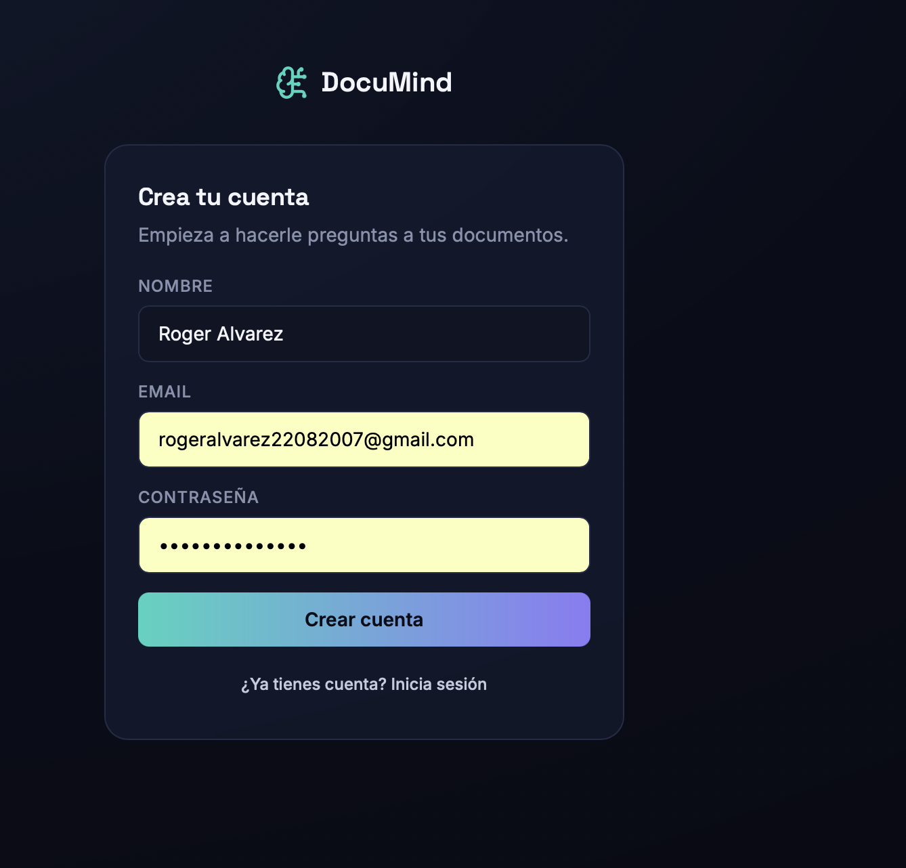
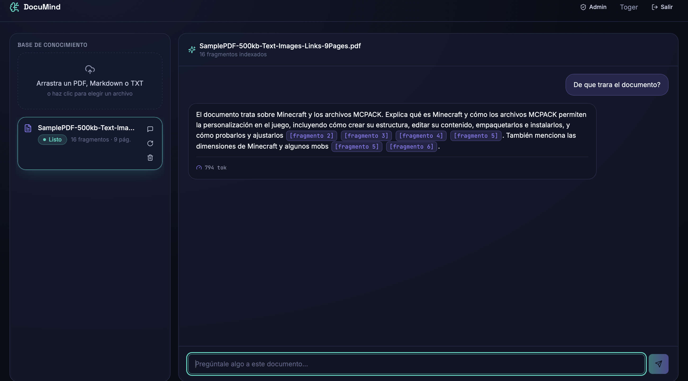
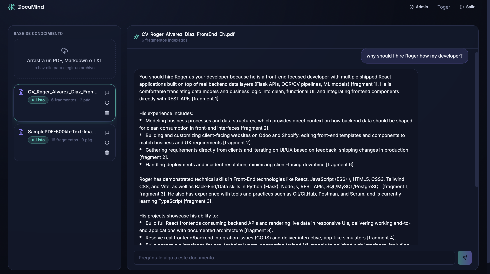

<div align="center">

# 🧠 DocuMind

### Upload a document. Ask it anything. Get answers with real citations.

An end-to-end **RAG (Retrieval-Augmented Generation)** platform: upload PDFs, Markdown,
or plain text, ask questions in natural language, and get streamed answers that always
point back to the exact source fragment and page they came from — with a full
authentication system, per-document conversation history, and an admin panel with
real usage metrics.

[](https://www.python.org/)
[](https://flask.palletsprojects.com/)
[](https://react.dev/)
[](https://www.typescriptlang.org/)
[](https://www.trychroma.com/)
[](https://ai.google.dev/)
[](#-license)

</div>

<br>

<p align="center">
  
</p>

---

## 📌 What problem does it solve?

Reading through long documents to find one specific answer is slow, and pasting entire
files into a generic chatbot is unreliable — the model has no way to prove where its
answer came from, and it will happily make things up when it doesn't actually know.

**DocuMind** solves both problems at once. It turns any PDF, Markdown, or text file into
a searchable knowledge base: the document is split into overlapping chunks, embedded into
a vector space, and stored in **ChromaDB**. When a user asks a question, DocuMind retrieves
only the chunks that are actually relevant, feeds them to **Gemini 2.5 Flash** under a
strict **anti-hallucination system prompt**, and streams back an answer that explicitly
cites `[fragment N]` for every claim — so every response can be traced back to a real
page in the source document.

This is not a toy prompt wrapper. It's a full-stack, production-shaped RAG system: JWT
authentication, per-user documents, persistent conversation history, token/cost tracking,
and an admin dashboard — the same pieces a real internal "chat with your docs" product
would need.

## ✨ Features

- 🔐 **Full authentication system** — registration, login, and JWT-protected routes. The
  very first account created automatically becomes the **admin**.
- 📄 **Multi-format ingestion** — upload PDF, Markdown, or plain text. PDFs are parsed
  **page-by-page** so every answer can cite the exact page it came from.
- ✂️ **Smart chunking with overlap** — text is split into overlapping windows (default
  800 characters, 150 overlap) so a sentence cut at a chunk boundary never loses context.
- 🧠 **Real RAG pipeline, not prompt stuffing** — Gemini embeddings → similarity search in
  ChromaDB → a token-budgeted context builder → Gemini 2.5 Flash generation.
- 🛡️ **Anti-hallucination system prompt** — the model is instructed to answer *only* from
  the retrieved context, to say clearly when the answer isn't there, and to cite every
  fragment it uses — never to rely on outside knowledge.
- 📚 **Source-cited answers** — every assistant message stores which chunks were used
  (`chunk_id`, page number, text preview), so the UI can show exactly where each answer
  came from.
- ⚡ **Real-time streaming** — answers are streamed token-by-token to the browser over
  **Server-Sent Events**, so the response appears live instead of after a long wait.
- 💬 **Persistent conversations per document** — every document keeps its own threads,
  with full message history reloaded on demand.
- 📊 **Token & cost transparency** — every document tracks the embedding tokens it cost to
  ingest, and every message tracks prompt/completion tokens, so usage is never a black box.
- 🛠️ **Admin dashboard** — total users, documents (ready/processing/failed), conversations,
  messages, and aggregated token usage across the whole platform, plus a full document list
  with owners.
- 🔁 **Document re-processing** — re-run the ingestion pipeline on a document without
  re-uploading the file, useful after tuning chunk size or fixing a failed ingest.

## ⚙️ How it works

```
                     ┌────────────────────────────────────────────┐
                     │                 INGESTION                   │
                     │                                              │
  Upload PDF/MD/TXT ─┼─▶ PyMuPDF (per-page text) ─▶ Overlapping     │
                     │   chunking ─▶ Gemini embeddings ─▶ ChromaDB  │
                     └────────────────────────────────────────────┘

                     ┌────────────────────────────────────────────┐
                     │                  RETRIEVAL                   │
                     │                                              │
        User query ──┼─▶ Gemini embedding ─▶ ChromaDB similarity   │
                     │   search (top-k) ─▶ token-budgeted context   │
                     │   builder ([fragment 1], [fragment 2], ...)  │
                     └────────────────────────────────────────────┘

                     ┌────────────────────────────────────────────┐
                     │                 GENERATION                   │
                     │                                              │
                     │   Anti-hallucination system prompt + context │
                     │   + conversation history ─▶ Gemini 2.5 Flash │
                     │   ─▶ streamed answer (SSE) + cited sources    │
                     └────────────────────────────────────────────┘
```

**Key design decisions:**

- **Character-based chunking with overlap, not token-based.** It's fast, has zero heavy
  tokenizer dependencies, and each chunk keeps its `page_number` so the UI can cite the
  exact page a claim came from.
- **The token counter is an offline heuristic (`len(text) / 4`), not `tiktoken`.**
  `tiktoken` downloads its BPE tables from a remote blob on first use, which fails in
  network-restricted environments (CI, PaaS, offline dev). The heuristic is accurate
  enough for a UI usage indicator and for context truncation — it is never used for
  anything that depends on exact billing.
- **Explicit anti-hallucination system prompt.** The model must say when the answer isn't
  in the context, and must reference `[fragment N]` for every claim, so the UI can map
  each statement to its exact source.
- **Streaming via Server-Sent Events, not WebSockets.** Simpler to deploy on Render/Vercel
  and is enough for a one-directional server → client flow like a chat response.
- **First-user-is-admin bootstrap.** No separate seed script or manual role assignment
  needed to get an admin account for the dashboard.

## 🖼️ Screenshots

<table>
<tr>
<td width="50%">

**Sign up**

Account creation flow. The very first registered user is automatically promoted to
`admin`, unlocking the metrics dashboard.



</td>
<td width="50%">

**Login**

JWT-based authentication — every API route beyond auth is protected behind a
bearer token issued here.



</td>
</tr>
<tr>
<td width="50%">

**Uploading a document**

A PDF is ingested end-to-end: text extraction, chunking, embedding, and indexing into
ChromaDB, with live status (`processing` → `ready`).


</td>
<td width="50%">

**Asking a question**

A question is answered using only the retrieved chunks, streamed live, with the exact
source fragments shown alongside the answer.


</td>
</tr>
<tr>
<td width="50%">

**First document, tested**

A full ingestion → question → cited-answer cycle on the first test document.



</td>
<td width="50%">

**Second document, tested**

The same pipeline running cleanly on a second, independent document — each document
gets its own isolated ChromaDB collection.



</td>
</tr>
</table>

## 🧰 Tech stack

| Layer | Technology |
|---|---|
| Backend | Python, Flask, Flask-SQLAlchemy, Flask-JWT-Extended, Flask-CORS |
| Vector store | ChromaDB (persistent client, one collection per document) |
| LLM & embeddings | Gemini 2.5 Flash + `text-embedding-004` (`google-genai`) |
| Document parsing | PyMuPDF (page-accurate PDF text extraction) |
| Database | PostgreSQL in production, SQLite for zero-setup local dev |
| Frontend | React 18, TypeScript, Vite |
| Styling | Tailwind CSS, shadcn/ui-style components (Dialog, Toast, Skeleton, tables) |
| Routing | React Router |
| Realtime | Server-Sent Events (SSE) for token-by-token streaming |
| Suggested deployment | Vercel (frontend) + Render (backend) + Neon (Postgres) |

## 📁 Project structure

```
documind/
├── backend/
│   ├── app/
│   │   ├── auth/            # registration, login, JWT, /me
│   │   ├── documents/       # upload, ingestion pipeline, CRUD, reprocess
│   │   ├── chat/            # RAG engine (rag.py) + conversations + SSE streaming
│   │   ├── admin/           # platform metrics + full document list
│   │   ├── models.py        # User, Document, Chunk, Conversation, Message
│   │   ├── config.py        # env-driven configuration
│   │   └── extensions.py
│   ├── requirements.txt
│   ├── Procfile              # gunicorn entrypoint for deployment
│   └── run.py
├── frontend/
│   └── src/
│       ├── components/       # DocumentPanel, ChatWindow, TokenCounter, ui/
│       ├── pages/             # Login, Dashboard, Admin
│       ├── hooks/useAuth.tsx
│       ├── lib/api.ts         # typed API client + SSE streaming
│       └── types/api.ts       # types shared with the backend contracts
└── Capturas/                  # screenshots used in this README
```

## 🚀 Running it locally

### 1. Backend

```bash
cd backend
python -m venv .venv && source .venv/bin/activate   # Windows: .venv\Scripts\activate
pip install -r requirements.txt
cp .env.example .env
# Edit .env and add your GEMINI_API_KEY (free at aistudio.google.com)
python run.py
```

The API will be running at `http://localhost:5001`. The first account that registers is
automatically promoted to `admin`.

### 2. Frontend

```bash
cd frontend
npm install
npm run dev
```

The app will be running at `http://localhost:5173` and already has a proxy configured for
`/api` pointing to the backend on port `5001` (see `vite.config.ts`), so there's no CORS
setup needed in development.

## 🔐 Environment variables

| Variable | Required | Description |
|---|---|---|
| `SECRET_KEY` / `JWT_SECRET_KEY` | Yes (prod) | Flask & JWT signing secrets — change before deploying |
| `DATABASE_URL` | No | Defaults to local SQLite; set to a Postgres URL in production |
| `CHROMA_PERSIST_DIR` | No | Where ChromaDB persists its vector data (default `./chroma_data`) |
| `GEMINI_API_KEY` | **Yes** | Powers embeddings and chat generation. Get one at [aistudio.google.com](https://aistudio.google.com/) |
| `GEMINI_CHAT_MODEL` | No | Defaults to `gemini-2.5-flash` |
| `GEMINI_EMBEDDING_MODEL` | No | Defaults to `text-embedding-004` |
| `CHUNK_SIZE` / `CHUNK_OVERLAP` | No | Ingestion chunking parameters (defaults: 800 / 150 characters) |
| `MAX_CONTEXT_TOKENS` | No | Caps how much retrieved context is sent to the LLM per turn (default 6000) |
| `FRONTEND_ORIGIN` | No | Allowed CORS origin for the frontend (default `http://localhost:5173`) |

## ☁️ Suggested free deployment

- **Frontend** → Vercel (connect the repo, *root directory* `frontend`)
- **Backend** → Render (*root directory* `backend`, build command
  `pip install -r requirements.txt`, start command `gunicorn run:app`, using the included
  `Procfile`)
- **Database** → Neon (free-tier PostgreSQL) — copy its connection string into
  `DATABASE_URL`
- **Vector store** → a persistent disk mounted on Render at `CHROMA_PERSIST_DIR`
- Set every secret (`GEMINI_API_KEY`, `SECRET_KEY`, `JWT_SECRET_KEY`, `DATABASE_URL`) in
  the Render dashboard — **never commit them to the repository.**

## 🗺️ Roadmap

- [ ] Background/async ingestion queue for large PDFs (instead of synchronous processing)
- [ ] Multi-document conversations (ask across a whole knowledge base, not just one file)
- [ ] Highlighted source snippets rendered inline in the chat, not just previews
- [ ] Configurable retrieval `top_k` and chunk size from the UI, per document
- [ ] Document sharing / team workspaces (currently documents are private per owner)
- [ ] Export a conversation (with citations) to Markdown or PDF
- [ ] Swap the character-based token heuristic for a proper tokenizer where billing accuracy matters
- [ ] Automated tests for the ingestion pipeline and the RAG retrieval/context builder

## 💼 How to pitch it on a resume

> Built a full-stack RAG platform that lets users upload documents (PDF, Markdown, TXT)
> and ask natural-language questions, returning streamed, source-cited answers. Implemented
> the complete pipeline — page-aware text extraction, overlapping chunking, Gemini
> embeddings, ChromaDB similarity search, and an anti-hallucination generation prompt —
> plus JWT authentication, per-document conversation history, and an admin dashboard with
> live token/cost metrics. Built with Flask, SQLAlchemy, ChromaDB, the Gemini API, React,
> and TypeScript.

**Problem → Solution → Impact**

- **Problem:** finding answers inside long documents is slow, and generic LLM chat has no
  way to prove where an answer actually came from — it will confidently fabricate details.
- **Solution:** a real retrieval-augmented pipeline (embeddings + vector search + budgeted
  context) paired with a generation prompt that is forced to cite its sources or admit it
  doesn't know, instead of guessing.
- **Impact:** answers become verifiable and trustworthy, usage stays transparent through
  built-in token/cost tracking, and the whole system is packaged as a real product —
  authentication, persistence, and an admin view included — not a single-file demo script.

## 📄 License

This project is released under the **MIT License** — see [LICENSE](LICENSE) for the full
text. In short: free to use, modify, and distribute, including for commercial purposes,
as long as the original copyright notice is kept.

## 👤 Author

**Roger Andrés Álvarez Díaz**
Computer Science and Systems Engineering

<p>
  <a href="https://github.com/TogerAndres">
    
  </a>
  <a href="https://www.linkedin.com/in/roger-andrés-alvarez-diaz-52b395333/">
    
  </a>
</p>

- 💻 GitHub: [github.com/TogerAndres](https://github.com/TogerAndres)
- 💼 LinkedIn: [roger-andrés-alvarez-diaz](https://www.linkedin.com/in/roger-andrés-alvarez-diaz-52b395333/)